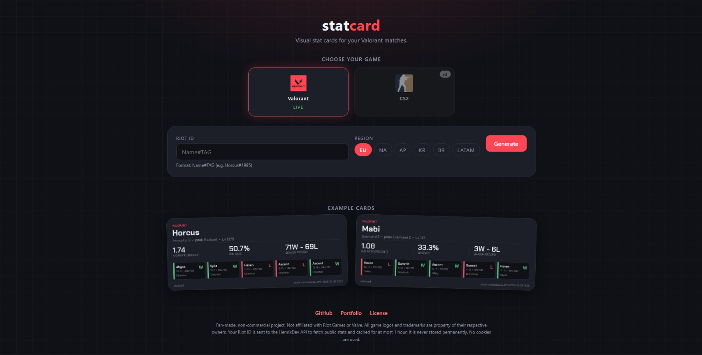

# 🎴 StatCard

> Genera tarjetas de estadísticas visuales y compartibles de tus juegos FPS favoritos.

[](https://www.python.org/)
[](https://fastapi.tiangolo.com/)
[](LICENSE)
[](https://github.com/astral-sh/ruff)

**Idioma:** [English](README.md) | **Español**

---

StatCard obtiene tus estadísticas de **Valorant**, las unifica en un formato común y genera una tarjeta PNG cuidada, lista para Discord, redes sociales o tu perfil de GitHub. Se ofrece como **CLI** y como **aplicación web pública**.

> 🌐 **Demo en vivo:** [statcard.pages.dev](https://statcard.pages.dev) — genera tu tarjeta sin instalar nada.

> 📦 **Estado:** v1 (CLI), v2 (aplicación web pública) y v2.1 (calidad y pulido) están terminadas y en producción. La v3 (más juegos e integraciones) está planificada. Mira la [hoja de ruta](#hoja-de-ruta).

---

## Captura



## Tarjeta de ejemplo


## Características

- 🎮 **Soporte de Valorant** mediante la [API de HenrikDev](https://docs.henrikdev.xyz)
- 🌐 **Aplicación web pública**: elige juego, escribe tu Riot ID y región, y obtén una tarjeta PNG. Sin instalar nada y sin cuenta
- ⚡ **Núcleo pensado para CLI**: un comando, una tarjeta
- 🎨 **Tema oscuro** con una paleta limpia y moderna
- 🔤 **Fuentes según el alfabeto**: latino y tailandés (Chakra Petch), coreano, japonés y chino (Noto Sans KR / JP / SC), cirílico (Noto Sans). Los nombres de jugador se ven bien sea cual sea su escritura
- 💾 **Caché en disco** para respetar los límites de la API: TTL de 10 min en la CLI y caché compartida de 1 h en la web
- 🛡️ **Límite de peticiones**: ventana deslizante de 3 por minuto por IP y 20 por minuto en total
- 🔒 **Privacidad y seguridad**: la clave de la API nunca sale del servidor, CSP y cabeceras de seguridad con `_headers`, sin cookies
- ♿ **Accesible**: contraste ≥ 4,5:1, enlace para saltar al contenido, foco de teclado visible, campos con etiqueta y `prefers-reduced-motion` respetado
- 🧪 **Tests sin conexión** con respuestas de la API guardadas

## Cómo funciona

```text
Navegador ──► Cloudflare Pages (frontend estático, HTML/JS/CSS puro)
                │  fetch
                ▼
        Backend FastAPI en Render ──► API de HenrikDev (datos de Valorant)
                │
                └─ Pillow genera la tarjeta PNG · caché en disco · limitador
```

Principio de diseño: cada juego tiene su propio **proveedor** (provider), que siempre devuelve el mismo formato común. El renderizador no sabe de dónde vienen los datos. Añadir un juego nuevo es escribir un módulo de proveedor más.

El diseño completo de la v2 está en [`docs/INFRASTRUCTURE.md`](docs/INFRASTRUCTURE.md).

## Stack tecnológico

| Componente              | Herramienta                                         |
| ----------------------- | --------------------------------------------------- |
| Lenguaje                | Python 3.12+                                        |
| Backend                 | FastAPI (servido con uvicorn)                       |
| Cliente HTTP            | `httpx`                                             |
| Validación de datos     | `pydantic`                                          |
| Renderizado de imagen   | `Pillow`                                            |
| Frontend                | HTML / CSS / JS puro, sin paso de build             |
| Alojamiento             | Cloudflare Pages (frontend) + plan gratuito de Render (backend) |
| Gestión de entorno      | `uv`                                                |
| Tests                   | `pytest`                                            |
| Linter y formateo       | `ruff`                                              |
| Comprobación de tipos   | `pyrefly`                                           |

## Hoja de ruta

### v1 — CLI de Valorant (terminada ✅)

- Proveedor de HenrikDev con K/D de temporada (con alternativa SEASON/RECENT)
- Fuentes multi-alfabeto (latino, tailandés, CJK, cirílico)
- Caché en disco (TTL de 10 min), CLI con argparse y tests sin conexión
- Licencia dual (PolyForm NC + comercial bajo petición)

### v2 — Aplicación web pública (terminada ✅)

- Backend FastAPI (`src/statcard/web/`): `/healthz`, `/api/valorant/{riot_id}` (PNG), `/api/valorant/{riot_id}/json`
- Límite de ventana deslizante (3/min por IP + 20/min global) y caché de disco compartida (TTL de 1 h)
- Frontend en HTML/JS/CSS puro (`frontend/`), sin paso de build
- Producción: backend en el plan gratuito de Render (con ping para mantenerlo despierto) y frontend en Cloudflare Pages

### v2.1 — Calidad web, pulido y selector de juegos (terminada ✅)

- **Selector de juegos** con logos oficiales: Valorant activo, CS2 desactivado con la etiqueta "v3"
- **SEO e identidad**: título único, meta descripción, canonical, favicon SVG, `robots.txt`, `sitemap.xml` y `404.html` con la estética de la web
- **Compartir en redes**: Open Graph y `twitter:card = summary_large_image` con una vista previa de 1200×630 generada con nuestro propio flujo de Pillow
- **Rendimiento**: fuentes WOFF2 alojadas en el propio repo (sin CDNs), imágenes con carga diferida y dimensiones explícitas, cero dependencias de JS
- **Accesibilidad**: contraste ≥ 4,5:1, enlace para saltar al contenido, foco de teclado visible, campos con etiqueta, textos `alt` y `prefers-reduced-motion` respetado
- **Seguridad**: `_headers` con CSP, `X-Content-Type-Options` y `Referrer-Policy`; caché inmutable de fuentes; la clave de la API nunca sale del servidor
- **Pulido de UX**: brillo en la portada, galería de tarjetas de ejemplo, esqueleto de carga, animación de entrada de la tarjeta, selector de región y cuenta atrás visual ante un 429
- **Confianza**: nota de privacidad (el Riot ID se envía a HenrikDev, se cachea ≤ 1 h, sin cookies), avisos de marcas registradas y enlaces de contacto

### v3 — Más juegos e integraciones (planificada 📋)

- Proveedor de CS2 (API de FACEIT frente a Leetify; fuente por decidir)
- Bot de Discord (`/stats`) que reutilice los proveedores
- Paginación de partidas para un K/D exacto de toda la temporada
- Detección automática de región (probar `eu` / `na` / `ap` / `kr` hasta que haya datos)

> **Sobre CS2:** Valve no ofrece una API pública con estadísticas competitivas de CS2. Las alternativas exigen verificación de identidad (API de FACEIT) o que el jugador use un servicio de analítica de terceros (Leetify). El soporte de CS2 llegará en la v3 cuando se elija la fuente de datos.

## Primeros pasos

### Requisitos

- Python 3.12+
- [uv](https://docs.astral.sh/uv/) (recomendado) o `pip` + `venv`
- Una clave de la API de HenrikDev: [consíguela aquí](https://dashboard.henrikdev.xyz/)

### Instalación

```bash
# 1. Clona el repositorio
git clone https://github.com/angelclassasir/statcard.git
cd statcard

# 2. Instala las dependencias
uv sync

# 3. Configura tu clave de la API
cp .env.example .env
# Edita .env y añade tu HENRIKDEV_API_KEY
```

### Uso de la CLI

```bash
# Generar una tarjeta de Valorant
python -m statcard valorant "TuNombre#TuTag"

# Forzar una consulta nueva (sin caché)
python -m statcard valorant "TuNombre#TuTag" --no-cache

# Indicar otra región
python -m statcard valorant "TuNombre#TuTag" --region na
```

Las imágenes se guardan en `output/`.

### Ejecutar la web en local

Abre dos terminales en la raíz del repositorio:

```bash
# Terminal 1: arrancar el backend FastAPI
uv run uvicorn statcard.web.app:app --port 8000

# Terminal 2: servir el frontend estático
cd frontend
uv run python -m http.server 8080
```

Después abre <http://127.0.0.1:8080> en el navegador. El frontend se conectará al backend local en <http://127.0.0.1:8000>.

💡 FastAPI también sirve una interfaz Swagger generada automáticamente en <http://127.0.0.1:8000/docs>.

### Ejecutar los tests

```bash
uv run pytest
```

La suite funciona sin conexión: usa respuestas de la API guardadas.

## Fuentes

El proyecto usa fuentes con licencia SIL Open Font License:

- **Chakra Petch** (latino + tailandés): incluida en el repositorio.
- **Noto Sans KR / JP / SC + Noto Sans** (CJK + Cyrillic fallbacks): pesan mucho (~40 MB total), así que se descargan en local y están excluidas de git. Ejecuta `uv run python scripts/fetch_noto_fonts.py` para descargarlas (también se ejecutan automáticamente en las compilaciones de Render). 

Consulta [`assets/fonts/README.md`](assets/fonts/README.md) para ver los comandos de descarga manual.

## Estructura del proyecto

```
statcard/
├── src/statcard/
│   ├── __main__.py            # Punto de entrada de la CLI (argparse)
│   ├── models.py              # Formato común de estadísticas (pydantic)
│   ├── cache.py               # Caché en disco con caducidad
│   ├── render.py              # Renderizado de la tarjeta (Pillow)
│   ├── providers/
│   │   └── valorant.py        # HenrikDev -> formato común
│   ├── themes/
│   │   └── dark.py            # Colores, fuentes y tamaños
│   └── web/                   # Backend FastAPI (v2)
│       ├── app.py             # Fábrica de la app + CORS + /healthz
│       ├── api.py             # Rutas /api/valorant (PNG + JSON)
│       ├── ratelimit.py       # Limitador de ventana deslizante (por IP + global)
│       └── settings.py        # Configuración desde variables de entorno
├── frontend/                  # Web estática -> Cloudflare Pages
│   ├── index.html             # Selector de juego, formulario, vista previa, galería
│   ├── app.js                 # Fetch, validación, esqueleto de carga, cuenta atrás del 429
│   ├── config.js              # URL del backend (Render)
│   ├── styles.css             # WOFF2 propio, brillo, animaciones, accesibilidad
│   ├── 404.html               # Página "PLAYER NOT FOUND" con la estética de la web
│   ├── _headers               # CSP, nosniff, Referrer-Policy, reglas de caché
│   ├── robots.txt             # Reglas de rastreo + referencia al sitemap
│   ├── sitemap.xml            # Sitemap de una sola página
│   ├── favicon.svg            # Marca de statcard
│   └── assets/                # Fuentes, logos de juegos, imagen OG, tarjetas de ejemplo
├── assets/fonts/              # Fuentes TTF originales (SIL OFL)
├── tests/                     # Suite pytest (sin conexión, respuestas guardadas)
├── scripts/
│   ├── smoke_valorant.py      # Comprobación manual contra la API real
│   └── render_social.py       # Genera la imagen OG de 1200×630
│   └── fetch_noto_fonts.py    # Descarga fuentes de reserva Noto que no están en git
├── docs/
│   ├── INFRASTRUCTURE.md      # Documento de diseño de la v2
│   └── images/                # Capturas del README
├── examples/                  # Tarjetas de ejemplo para este README
├── .env.example               # Plantilla de claves de API
└── pyproject.toml
```

## Avisos legales

Es un proyecto de fans, educativo y sin ánimo de lucro.

- No está afiliado, respaldado ni patrocinado por Riot Games.
- Los datos de Valorant se obtienen mediante la API no oficial de HenrikDev.
- Valorant y las marcas relacionadas son propiedad de Riot Games, Inc.
- Todos los recursos visuales (fondos, iconos, fuentes) son originales, creados por el autor o proceden de licencias libres (SIL OFL), salvo los logos de juegos de terceros del selector, que pertenecen a sus respectivos propietarios.

## Licencia

Este proyecto usa una **licencia dual**:

- **Uso no comercial** (personal, educativo, afición): gratis bajo la [PolyForm Noncommercial License 1.0.0](https://polyformproject.org/licenses/noncommercial/1.0.0).
- **Uso comercial**: requiere autorización expresa y por escrito del autor. ¿Quieres usar StatCard con fines comerciales? [Abre un issue](https://github.com/angelclassasir/statcard/issues) para hablarlo.

Consulta el archivo [LICENSE](LICENSE) para ver los términos completos.

## Autor

Creado por **Ángel**, estudiante de sistemas y redes. [Portafolio](https://callmeangel.pages.dev/) · [GitHub](https://github.com/angelclassasir)
