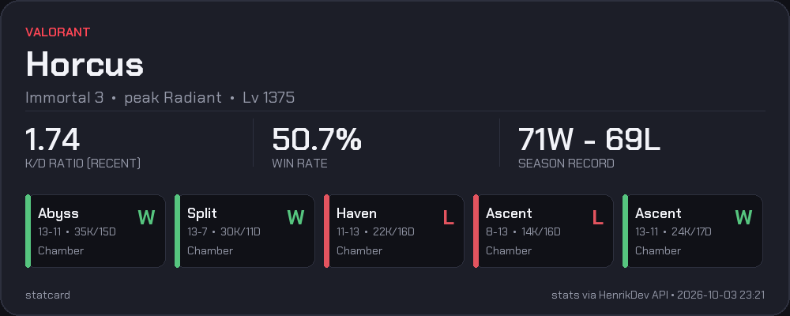

---

## `README.es.md`

```markdown
# 🎴 StatCard

> Genera tarjetas visuales con tus estadísticas de tus juegos FPS favoritos.

[](https://www.python.org/)
[](LICENSE)
[](https://github.com/astral-sh/ruff)

**Idioma:** [English](README.md) | **Español**

---

`statcard` obtiene tus estadísticas de **Valorant**, las unifica en un formato común y las renderiza en una tarjeta PNG lista para compartir en Discord, redes sociales o tu perfil de GitHub.

> ⚠️ **Estado del proyecto:** v1 (Valorant) funcional — pulido del CLI y tests offline en curso. El soporte para CS2 está planeado para la v2 (ver [Hoja de ruta](#-hoja-de-ruta)).

---

## ✨ Características

- 🎮 **Soporte para Valorant** mediante la [HenrikDev API](https://docs.henrikdev.xyz)
- 🎨 **Tema oscuro** con una paleta limpia y moderna
- 🔤 **Fuentes según alfabeto**: latín (Chakra Petch), coreano (Noto Sans KR), japonés (Noto Sans JP), chino (Noto Sans SC), cirílico (Noto Sans) — los nombres se renderizan correctamente sea cual sea el alfabeto
- 💾 **Caché en disco inteligente** (TTL de 10 min) para respetar los límites de las APIs
- ⚡ **Diseño CLI-first**: un comando, una tarjeta
- 🧪 **Suite de tests offline** usando respuestas guardadas
- 🌐 **Interfaz web** *(planificada para la v2)*: genera tu tarjeta sin instalar nada

## 🖼️ Ejemplo

| Valorant |
| :---: |
|  |

## 🛠️ Stack Tecnológico

| Componente | Herramienta |
| --- | --- |
| Lenguaje | Python 3.12+ |
| Cliente HTTP | `httpx` |
| Validación de datos | `pydantic` |
| Renderizado de imágenes | `Pillow` |
| Gestión de entorno | `uv` |
| Testing | `pytest` |
| Linting y formateo | `ruff` |
| Chequeo de tipos | `pyrefly` |

## 🗺️ Roadmap

### v1 — CLI de Valorant (publicado ✅)
- Provider HenrikDev con K/D de temporada (fallback SEASON/RECENT)
- Fuentes multialfabeto (latín, tailandés, CJK, cirílico)
- Paginación de partidas para K/D exacto de temporada completa
- Auto-detección de región
- Caché en disco, CLI con argparse, suite de tests offline

### v2 — Aplicación web pública (en progreso 🚧)
- Backend FastAPI en Railway (tier gratuito, objetivo 24/7)
- Frontend HTML/JS vanilla en Cloudflare Pages
- Caché compartida por jugador (TTL 1 h) + rate limit 3 req/min por visitante
- Documento de diseño: [`docs/INFRASTRUCTURE.md`](docs/INFRASTRUCTURE.md)

### v3 — Más juegos e integraciones (planificado 📋)
- Provider CS2 (FACEIT Data API vs Leetify — fuente por decidir)
- Bot de Discord (`/stats`) reutilizando providers

> **Sobre CS2:** Valve no expone una API pública para las estadísticas competitivas de CS2. Las alternativas o requieren verificación de identidad (FACEIT Data API) o dependen de que el jugador use un servicio de análisis de terceros (Leetify). El soporte de CS2 llegará en la v3, una vez elegida la fuente de datos.

## 🚀 Primeros pasos

### Requisitos previos

- Python 3.12+
- [uv](https://docs.astral.sh/uv/) (recomendado) o `pip` + `venv`
- Una clave de HenrikDev: [consíguela aquí](https://dashboard.henrikdev.xyz/)

### Instalación

```bash
# 1. Clona el repositorio
git clone https://github.com/angelclassasir/statcard.git
cd statcard

# 2. Instala las dependencias
uv sync

# 3. Configura tu clave de API
cp .env.example .env
# Edita .env y añade tu HENRIKDEV_API_KEY
```

### Uso

```bash
# Genera tu tarjeta de Valorant
python -m statcard valorant "TuNombre#TuTag"
```
Las imágenes de salida se guardan en output/.

## Fuentes
El proyecto usa fuentes bajo la licencia SIL Open Font License:

    Chakra Petch (latín + tailandés) — incluida en el repo.
    Noto Sans KR / JP / SC + Noto Sans (respaldos CJK + cirílico) — pesadas (~40 MB en total), por lo que se descargan localmente y se ignoran en git. Ver assets/fonts/README.md para los comandos de descarga.


## 📁 Estructura del Proyecto
```text
statcard/
├── src/statcard/
│   ├── __main__.py       # Punto de entrada del CLI
│   ├── models.py         # Formato común de estadísticas (pydantic)
│   ├── cache.py          # Caché en disco con caducidad
│   ├── render.py         # Renderizado de tarjetas (Pillow)
│   ├── providers/
│   │   └── valorant.py   # HenrikDev -> formato común
│   └── themes/
│       └── dark.py       # Colores, fuentes, tamaños
├── assets/
│   └── fonts/            # Fuentes SIL OFL (ver assets/fonts/README.md)
├── tests/
│   ├── fixtures/         # Respuestas guardadas de las APIs para tests offline
│   └── test_*.py
├── examples/             # Tarjetas de ejemplo para este README
├── output/               # Tarjetas generadas (ignorado por git)
├── .env.example          # Plantilla para las claves de API
└── pyproject.toml
```

El principio de diseño clave es: cada juego tiene su propio provider que siempre devuelve el mismo formato común. El renderizador nunca sabe de dónde provienen los datos. Añadir un nuevo juego es simplemente escribir un módulo provider más.

## ⚖️ Avisos legales
Este es un proyecto educativo hecho por fans, sin ánimo de lucro.

    No está afiliado, respaldado ni patrocinado por Riot Games.
    Los datos de Valorant se obtienen a través de la API no oficial HenrikDev.

    Valorant y sus marcas comerciales son propiedad de Riot Games, Inc.
    Assets: todos los recursos visuales (fondos, iconos, fuentes) son originales, creados por el autor, o provienen de licencias libres/abiertas (SIL OFL).

## 📄 Licencia

Este proyecto usa una **licencia dual**:

- **Uso no comercial** (personal, educativo, hobby): gratuito bajo la [PolyForm Noncommercial License 1.0.0](https://polyformproject.org/licenses/noncommercial/1.0.0).
- **Uso comercial**: requiere autorización expresa y por escrito del autor. ¿Quieres usar statcard con fines comerciales? [Abre un issue](https://github.com/angelclassasir/statcard/issues) o contáctame para negociar una licencia comercial.

Consulta el archivo [LICENSE](LICENSE) para los términos completos.
